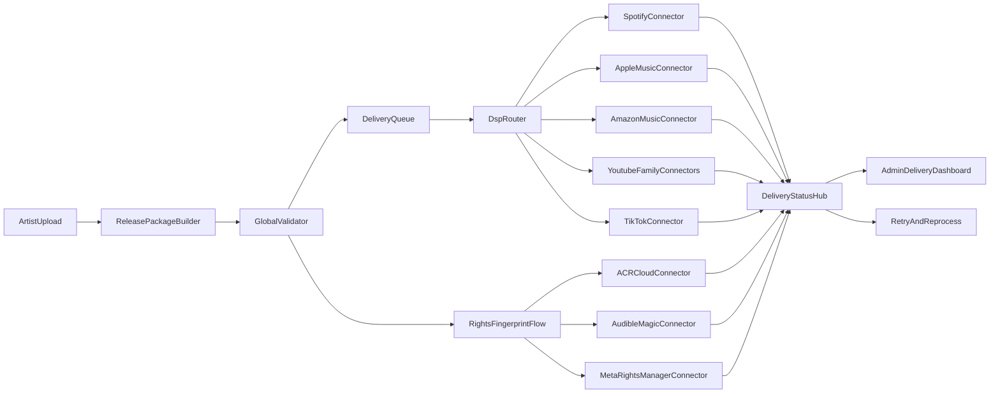

# DSP Integration Plan (Simple + Scalable)

## Goal

Deliver one release from your system to many DSPs reliably, with clear status, retries, error handling, and rights/fingerprinting support.

You already have good foundation (`StoreService`, store integrations, delivery helpers). Plan expands that into a full connector platform.

## What "done" looks like

- Artist uploads release once.
- System validates metadata/assets once.
- System sends package to selected DSPs.
- Each DSP returns delivery status (processing/live/rejected/takedown).
- Admin sees full timeline and can retry/fix.
- Rights/fingerprinting platforms run as separate but connected workflows.

## Existing Project Areas To Leverage

- Backend delivery/orchestration layer in [C:/Users/jaisi/Documents/GDS Creatives/nextjs-singleaudio/server/src/services/store.service.ts](C:/Users/jaisi/Documents/GDS Creatives/nextjs-singleaudio/server/src/services/store.service.ts)
- Integration factory/registry in [C:/Users/jaisi/Documents/GDS Creatives/nextjs-singleaudio/server/src/services/store.factory.ts](C:/Users/jaisi/Documents/GDS Creatives/nextjs-singleaudio/server/src/services/store.factory.ts)
- Existing DSP connectors (pattern base):
  - [C:/Users/jaisi/Documents/GDS Creatives/nextjs-singleaudio/server/src/services/stores/spotify.store.ts](C:/Users/jaisi/Documents/GDS Creatives/nextjs-singleaudio/server/src/services/stores/spotify.store.ts)
  - [C:/Users/jaisi/Documents/GDS Creatives/nextjs-singleaudio/server/src/services/stores/apple-music.store.ts](C:/Users/jaisi/Documents/GDS Creatives/nextjs-singleaudio/server/src/services/stores/apple-music.store.ts)
  - [C:/Users/jaisi/Documents/GDS Creatives/nextjs-singleaudio/server/src/services/stores/youtube-content-id.store.ts](C:/Users/jaisi/Documents/GDS Creatives/nextjs-singleaudio/server/src/services/stores/youtube-content-id.store.ts)
- API route modules for release/upload flow in [C:/Users/jaisi/Documents/GDS Creatives/nextjs-singleaudio/server/src/routes](C:/Users/jaisi/Documents/GDS Creatives/nextjs-singleaudio/server/src/routes)
- Admin UI areas in [C:/Users/jaisi/Documents/GDS Creatives/nextjs-singleaudio/src/app/(auth)/admin](C:/Users/jaisi/Documents/GDS Creatives/nextjs-singleaudio/src/app/(auth)/admin)

## Architecture Approach (easy view)

## Platform Grouping (so work stays manageable)

### Group A: Core Global DSP (Phase 1)

Spotify, Apple Music, Amazon Music, YouTube Music, YouTube Art Track, YouTube Content ID, TikTok, Deezer, SoundCloud, TIDAL, Pandora, iHeartRadio.

### Group B: Regional + Growth DSP (Phase 2)

JioSaavn, Gaana, Wynk Music, Hungama Music, Anghami, Boomplay, NetEase Cloud Music, KKBox, Audiomack, AWA, Qobuz, TouchTunes, Trebel, Tuned Global, iMusica, Mixcloud.

### Group C: Rights / UGC / Social / Fingerprinting (Phase 3)

Facebook Audio Library, Facebook Rights Manager, Instagram, WhatsApp, Snapchat, Resso, ACRCloud, Audible Magic, Jaxsta, Audio Fingerprinting workflows.

## Implementation Phases

## Phase 0 (2 weeks) - Foundation hardening

- Define one strict connector interface (auth, validate, deliver, update, takedown, status fetch, webhook processing).
- Add per-DSP config model (credentials, regions, feature flags, rate limits).
- Create delivery job model + event log model (attempts, response payload, error codes).
- Add idempotency key strategy to avoid duplicate deliveries.
- Add exponential backoff retry policy and dead-letter queue handling.

## Phase 1 (8-12 weeks) - Major global direct integrations

- Implement/upgrade direct connectors for: Spotify, Apple Music, Amazon Music, YouTube family, TikTok, Deezer, SoundCloud, TIDAL.
- Normalize all metadata map rules (title, contributors, ISRC, UPC, genre, territory windows, content rating).
- Add asset packaging pipeline (audio transcode checks, artwork specs, checksums, upload handoff).
- Build DSP webhook/callback receiver endpoints for async status updates.
- Build admin delivery board: per-release, per-track, per-DSP status + retry + audit timeline.

## Phase 2 (10-14 weeks) - Regional platform wave

- Add regional adapters (India, MENA, Asia) using same connector contract.
- Add region-specific compliance rules (language, script fields, local category mappings).
- Add bulk resync job (refresh status across older catalog).
- Add operational controls: connector pause, maintenance mode, queue draining.

## Phase 3 (8-10 weeks) - Rights + social ecosystems

- Build separate rights pipeline (ownership claims, reference files, takedown/dispute lifecycle).
- Integrate YouTube Content ID, Facebook Rights Manager, ACRCloud/Audible Magic workflows.
- Add match-result ingestion and policy actions (monitor, claim, block, monetize).
- Add legal audit trail for every claim/takedown action.

## Phase 4 (ongoing) - Reliability + scale

- SLO targets (delivery success %, avg time to live, callback latency, retry recovery rate).
- Metrics + alerts per connector (5xx spikes, auth failures, queue lag).
- Contract tests and sandbox certification packs per DSP.
- Runbook docs for ops and support teams.

## Data model additions (high level)

- `dsp_providers` (platform metadata, capabilities)
- `dsp_credentials` (secure tokens/keys with rotation metadata)
- `delivery_jobs` (release->dsp dispatch)
- `delivery_attempts` (each API call attempt + payload hash)
- `delivery_events` (state timeline)
- `rights_claims` (claim lifecycle)
- `fingerprint_matches` (external match evidence)
- `dsp_webhook_events` (raw callback store + signature verification result)

## Security + compliance approach

- Encrypt DSP secrets at rest; rotate tokens on schedule.
- Verify webhook signatures for all DSP callbacks.
- Add rate limiting per connector to respect partner quotas.
- Keep full audit logs for metadata edits, redeliveries, takedowns.
- Isolate PII and rights evidence with strict access roles.

## Testing approach (simple but strong)

- Unit tests: connector mapping, validation, and error translation.
- Contract tests: each DSP sandbox API response shape.
- End-to-end tests: upload -> dispatch -> callback -> final status.
- Failure drills: token expired, partial outage, duplicate callback, malformed payload.

## Team execution model

- Squad 1: Connector implementation (DSP APIs)
- Squad 2: Core delivery platform (queue/retry/status/events)
- Squad 3: Admin UX + operations dashboard
- Squad 4: Rights/fingerprinting + compliance

## Risks and mitigation

- DSP API differences: solved by strict connector contract + mapper layer.
- Credential churn: solved by centralized secret lifecycle + health checks.
- Async status inconsistency: solved by webhook + scheduled pull reconciliation.
- Scale bottlenecks: solved by queued async workers and backpressure control.

## First sprint backlog (what we do first)

1. Freeze connector interface and error taxonomy.
2. Implement `delivery_jobs` + `delivery_attempts` + event timeline schema.
3. Refactor existing Spotify/Apple/YouTube connectors to new contract.
4. Add Amazon Music connector skeleton + sandbox auth flow.
5. Add callback endpoint framework with signature verification.
6. Build minimal admin status page (release x DSP matrix).
7. Add retry engine with exponential backoff and dead-letter handling.

## Estimated timeline (realistic)

- Phase 0-1 MVP for major DSPs: ~3 to 4 months
- Phase 2 regional wave: +2 to 3 months
- Phase 3 rights/fingerprinting: +2 months
- Total for broad 40-platform direct stack: ~7 to 9 months with parallel team

## How I will approach implementation in your codebase

- Step 1: audit current store integration code and normalize connector contract.
- Step 2: introduce delivery job/event persistence and queue-based orchestration.
- Step 3: migrate existing connectors first (no big-bang rewrite).
- Step 4: add new DSPs in waves using reusable mapper + transport utilities.
- Step 5: add admin observability early so failures visible from day one.
- Step 6: add rights/fingerprinting pipeline as dedicated module, linked to release lifecycle.
- Step 7: harden with contract tests, runbooks, and production monitoring before each wave.

