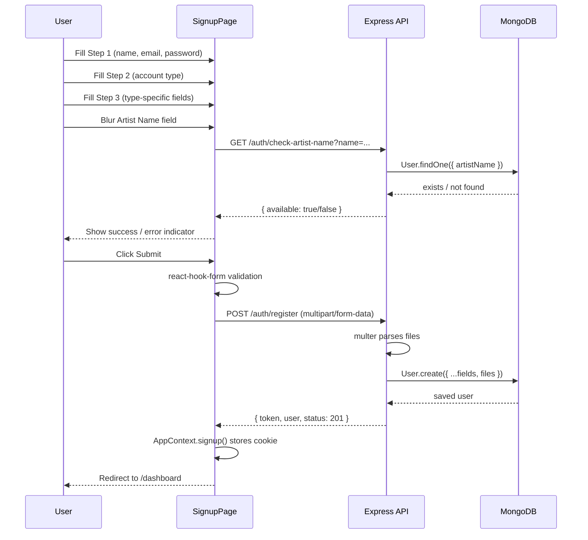

# Design Document: Signup Form Redesign

## Overview

Replace the current single-page signup form with a polished, multi-step registration experience that collects account-type-specific data for Artists and Labels. The redesign matches the existing login page aesthetic (dark glassmorphism, `#4a6cf7` primary, `#0f0f1a` background), uses `react-hook-form` with MUI v5 throughout, and extends the backend User model + auth controller to persist the new fields via `multipart/form-data`.

Two additional routing changes ship with this feature:
- Root `/` redirects to `/login` (login becomes the homepage).
- The public layout removes the `Container` wrapper so login and signup render as full-page experiences.

### Key Design Decisions

| Decision | Rationale |
|---|---|
| `react-hook-form` with `Controller` wrappers | Matches existing login page pattern; avoids uncontrolled-to-controlled warnings with MUI |
| `multipart/form-data` for the register endpoint | Required to carry file uploads (government ID, certificates) in a single request |
| Multer on the backend for file handling | Already used for track/artwork uploads; consistent with existing infrastructure |
| Separate `IUserOnboarding` sub-document on User model | Keeps onboarding fields isolated from core auth fields; easier to query/index |
| Artist name uniqueness check via dedicated endpoint | Allows real-time feedback before form submission; decoupled from the register flow |
| Step state held in a single `useForm` instance | Preserves all values across steps without extra state management; Back navigation is free |
| Public layout split into full-page vs. contained variants | Login and signup need edge-to-edge backgrounds; other public pages (artist profiles) still need the container |

---

## Architecture

### Frontend

```
src/
├── app/
│   ├── (public)/
│   │   ├── layout.tsx                  ← Remove Container; render children directly
│   │   ├── page.tsx                    ← Replace with redirect to /login
│   │   ├── login/page.tsx              ← Unchanged
│   │   └── signup/
│   │       └── page.tsx                ← Full rewrite (multi-step form)
│   └── (auth)/
│       └── ...                         ← Unchanged
├── components/
│   └── signup/
│       ├── SignupStepper.tsx            ← Step indicator component
│       ├── Step1BasicInfo.tsx           ← Name, email, password fields
│       ├── Step2AccountType.tsx         ← Artist / Label selector
│       ├── Step3Artist.tsx              ← Artist-specific fields
│       ├── Step3Label.tsx               ← Label-specific fields
│       └── FileDropZone.tsx             ← Reusable drag-and-drop upload control
└── services/
    └── api.ts                           ← Add checkArtistNameAvailability()
```

### Backend

```
server/src/
├── models/
│   └── user.model.ts                   ← Extend with onboarding sub-document
├── controllers/
│   └── auth.controller.ts              ← Update register(); add checkArtistName()
├── routes/
│   └── auth.routes.ts                  ← Add GET /auth/check-artist-name
├── validators/
│   └── auth.validator.ts               ← Extend registerValidator for new fields
└── utils/
    └── fileUpload.ts                   ← Add registrationUpload multer config
```

### Data Flow



---

## Components and Interfaces

### `SignupPage` (`src/app/(public)/signup/page.tsx`)

Top-level page component. Owns the `useForm` instance and step state. Handles the signup-enabled gate check on mount.

```typescript
type SignupFormValues = {
  // Step 1
  name: string;
  email: string;
  password: string;
  confirmPassword: string;

  // Step 2
  accountType: 'artist' | 'label' | '';

  // Step 3 — Artist
  artistName: string;
  legalName: string;
  idType: 'pan' | 'aadhaar';
  panId: string;
  aadhaarId: string;
  legalAddress: string;
  phoneNumber: string;
  numberOfTracks: number | '';
  numberOfReleases: number | '';
  governmentIdFile: File | null;

  // Step 3 — Label
  labelName: string;
  registrationType: 'individual' | 'registered_company' | '';
  labelLegalName: string;           // for individual
  legalEntityName: string;          // for registered company
  companyType: 'private' | 'public' | '';
  incorporationCertFile: File | null;
  gstCertFile: File | null;
  labelGovIdFile: File | null;      // for individual
  totalArtists: number | '';
  totalRevenue: number | '';
  catalogSize: number | '';
  rightsType: 'exclusive' | 'non_exclusive' | '';
  companyWebsite: string;
  socialLinks: {
    instagram: string;
    twitter: string;
    facebook: string;
    youtube: string;
  };
};
```

Step navigation is controlled by a `currentStep: 1 | 2 | 3` state variable. The `useForm` instance is created once at the page level and passed down via props.

### `SignupStepper` (`src/components/signup/SignupStepper.tsx`)

```typescript
interface SignupStepperProps {
  currentStep: 1 | 2 | 3;
  steps: { label: string }[];
}
```

Renders a horizontal MUI `Stepper` with `Step`, `StepLabel`, and a `LinearProgress` bar below it. Active step uses `#4a6cf7`.

### `Step1BasicInfo`

```typescript
interface Step1Props {
  control: Control<SignupFormValues>;
  errors: FieldErrors<SignupFormValues>;
  isSubmitting: boolean;
}
```

Renders: Full Name, Email, Password (with show/hide), Confirm Password (with show/hide). All wrapped in `Controller`.

### `Step2AccountType`

```typescript
interface Step2Props {
  control: Control<SignupFormValues>;
  errors: FieldErrors<SignupFormValues>;
  onAccountTypeChange: (type: 'artist' | 'label') => void;
}
```

Renders two large toggle cards (Artist / Label) using MUI `ToggleButtonGroup`. On change, calls `onAccountTypeChange` which resets all Step 3 fields via `react-hook-form`'s `resetField`.

### `Step3Artist`

```typescript
interface Step3ArtistProps {
  control: Control<SignupFormValues>;
  errors: FieldErrors<SignupFormValues>;
  isSubmitting: boolean;
  artistNameStatus: 'idle' | 'checking' | 'available' | 'taken' | 'error';
  onArtistNameBlur: () => void;
}
```

Renders all artist-specific fields. The `artistNameStatus` prop drives the adornment on the Artist Name field (spinner / check / error icon).

### `Step3Label`

```typescript
interface Step3LabelProps {
  control: Control<SignupFormValues>;
  errors: FieldErrors<SignupFormValues>;
  isSubmitting: boolean;
  registrationType: 'individual' | 'registered_company' | '';
  companyType: 'private' | 'public' | '';
}
```

Renders all label-specific fields with conditional sections driven by `registrationType` and `companyType` watch values.

### `FileDropZone`

```typescript
interface FileDropZoneProps {
  label: string;
  accept: string;           // e.g. "image/jpeg,image/png" or "application/pdf"
  hint: string;             // e.g. "JPEG or PNG, max 5 MB"
  value: File | null;
  onChange: (file: File | null) => void;
  error?: string;
  disabled?: boolean;
}
```

Renders a dashed-border drop zone with drag-and-drop support (`onDragOver`, `onDrop`) and a hidden `<input type="file">` triggered by a "Browse" button. Shows selected filename and a clear button when a file is chosen.

### Backend: `checkArtistName` controller

```typescript
// GET /api/auth/check-artist-name?name=<artistName>
export const checkArtistName = async (req: Request, res: Response): Promise<void> => {
  const { name } = req.query;
  const exists = await User.findOne({
    artistName: { $regex: new RegExp(`^${escapeRegex(name as string)}$`, 'i') }
  });
  successResponse(res, { available: !exists });
};
```

Case-insensitive match to prevent near-duplicate names.

### Backend: Updated `register` controller

Accepts `multipart/form-data`. After multer processes files, constructs the user document with the full onboarding sub-document. Returns 400 with `"Artist name is already taken"` if `artistName` already exists.

---

## Data Models

### Extended `IUser` (Mongoose)

```typescript
// server/src/models/user.model.ts

export interface IArtistOnboarding {
  legalName: string;
  idType: 'pan' | 'aadhaar';
  idNumber: string;
  legalAddress: string;
  phoneNumber: string;
  numberOfTracks: number;
  numberOfReleases: number;
  governmentIdFile: string;   // stored path / URL
}

export interface ILabelOnboarding {
  labelName: string;
  registrationType: 'individual' | 'registered_company';
  // individual
  legalName?: string;
  labelGovIdFile?: string;
  // registered company
  legalEntityName?: string;
  companyType?: 'private' | 'public';
  certificateFile?: string;   // incorporation cert or GST cert path
  // shared
  totalArtists: number;
  totalRevenue: number;
  catalogSize: number;
  rightsType: 'exclusive' | 'non_exclusive';
  companyWebsite?: string;
  socialLinks?: {
    instagram?: string;
    twitter?: string;
    facebook?: string;
    youtube?: string;
  };
}

export interface IUser extends Document {
  name: string;
  email: string;
  password: string;
  role: 'artist' | 'label' | 'admin';
  profilePicture?: string;
  artistName?: string;          // unique, sparse index
  bio?: string;
  socialLinks?: { ... };
  onboarding?: IArtistOnboarding | ILabelOnboarding;
  accountType?: 'artist' | 'label';
  createdAt: Date;
  updatedAt: Date;
  comparePassword(candidatePassword: string): Promise<boolean>;
}
```

**Schema changes:**

```typescript
// New fields added to UserSchema
accountType: {
  type: String,
  enum: ['artist', 'label'],
},
artistName: {
  type: String,
  trim: true,
  sparse: true,   // allows multiple null values
  unique: true,   // enforces uniqueness at DB level (Req 9.10)
},
onboarding: {
  type: Schema.Types.Mixed,  // stores either IArtistOnboarding or ILabelOnboarding
},
```

The `onboarding` field uses `Mixed` type to accommodate the two divergent shapes. A `discriminator`-style `accountType` field identifies which shape is stored.

### File Storage

Registration files (government IDs, certificates) are stored in a new `uploads/registration/` directory on disk (development) or uploaded to the configured cloud storage provider (production). The stored path/URL is saved in the `onboarding` sub-document.

```typescript
// New multer config in server/src/utils/fileUpload.ts
export const uploadRegistrationFiles = multer({
  storage: multer.diskStorage({
    destination: REGISTRATION_DIR,
    filename: (_req, file, cb) => cb(null, `${uuidv4()}${path.extname(file.originalname)}`),
  }),
  limits: { fileSize: 10 * 1024 * 1024 }, // 10 MB
  fileFilter: registrationFileFilter,       // accepts image/jpeg, image/png, application/pdf
});
```

Fields accepted: `governmentIdFile`, `labelGovIdFile`, `incorporationCertFile`, `gstCertFile`.

### `AppContext` changes

The `SignupPayload` interface is extended to carry all new fields. The `signup` function sends a `FormData` object instead of JSON when files are present:

```typescript
interface SignupPayload {
  name: string;
  email: string;
  password: string;
  accountType: 'artist' | 'label';
  // artist fields
  artistName?: string;
  legalName?: string;
  idType?: 'pan' | 'aadhaar';
  idNumber?: string;
  legalAddress?: string;
  phoneNumber?: string;
  numberOfTracks?: number;
  numberOfReleases?: number;
  governmentIdFile?: File;
  // label fields
  labelName?: string;
  registrationType?: string;
  legalEntityName?: string;
  companyType?: string;
  certificateFile?: File;
  labelGovIdFile?: File;
  totalArtists?: number;
  totalRevenue?: number;
  catalogSize?: number;
  rightsType?: string;
  companyWebsite?: string;
  socialLinks?: Record<string, string>;
}
```

---

## Correctness Properties

*A property is a characteristic or behavior that should hold true across all valid executions of a system — essentially, a formal statement about what the system should do. Properties serve as the bridge between human-readable specifications and machine-verifiable correctness guarantees.*

### Property Reflection

Before listing properties, redundancy is eliminated:

- 1.3 (validation blocks advance) and 1.4 (inline errors shown) describe the same invariant — combined into Property 1.
- 2.5 (name length), 2.6 (email pattern), 2.7 (password length), 2.8 (confirm password match) are all field-level validation properties — kept separate because they test distinct validators.
- 7.1 (PAN), 7.2 (Aadhaar), 7.3 (phone), 7.4–7.7 (file types), 7.8–7.9 (URLs) are all validation properties over different input spaces — kept separate.
- 9.2 and 9.3 (backend persists artist fields / label fields) can be combined into one round-trip property per account type.
- 3.5 (clearing Step 3 on account type change) and the ID toggle exclusivity (4.14) are distinct behavioral properties — kept separate.

---

### Property 1: Validation gates step advancement

*For any* step in the multi-step form and any combination of field values where at least one required field is empty or invalid, clicking "Next" should not increment the current step counter, and at least one inline error message should be visible.

**Validates: Requirements 1.3, 1.4**

---

### Property 2: Back navigation preserves field values

*For any* set of values entered across Steps 1 and 2, navigating backward and then forward should result in all previously entered values being identical to what was entered originally.

**Validates: Requirements 1.5**

---

### Property 3: Step indicator reflects current step

*For any* current step index in {1, 2, 3}, the rendered `SignupStepper` should display that exact step number as active, show total steps as 3, and render a `LinearProgress` bar at `((currentStep - 1) / 2) * 100` percent.

**Validates: Requirements 1.2**

---

### Property 4: Full Name length validation

*For any* string with length > 50 characters, the Full Name field validation should fail. *For any* non-empty string with length ≤ 50 characters, the Full Name field validation should pass.

**Validates: Requirements 2.5**

---

### Property 5: Email format validation

*For any* string that matches the pattern `^\w+([.-]?\w+)*@\w+([.-]?\w+)*(\.\w{2,3})+$`, email validation should pass. *For any* string that does not match this pattern, email validation should fail.

**Validates: Requirements 2.6**

---

### Property 6: Password length validation

*For any* string with length < 8, password validation should fail. *For any* string with length ≥ 8, password validation should pass.

**Validates: Requirements 2.7**

---

### Property 7: Confirm password match validation

*For any* pair of strings (password, confirmPassword) where the two strings are not equal, the confirm password validator should return the error "Passwords do not match". *For any* pair where they are equal, validation should pass.

**Validates: Requirements 2.8, 2.9**

---

### Property 8: Account type change clears Step 3 fields

*For any* set of Step 3 field values entered under account type A, switching to account type B should result in all fields that belong exclusively to type A being reset to their default empty values.

**Validates: Requirements 3.5**

---

### Property 9: ID toggle exclusivity

*For any* `idType` value in {'pan', 'aadhaar'}, exactly one of the PAN_ID field and the Aadhaar_ID field should be visible and required, and the other should be hidden and not required.

**Validates: Requirements 4.5, 4.6, 4.14**

---

### Property 10: PAN_ID format validation

*For any* string that matches `^[A-Z]{5}[0-9]{4}[A-Z]{1}$`, PAN validation should pass. *For any* string that does not match, PAN validation should fail with the message "Invalid PAN format (e.g. ABCDE1234F)".

**Validates: Requirements 7.1**

---

### Property 11: Aadhaar_ID format validation

*For any* string of exactly 12 digits (`^\d{12}$`), Aadhaar validation should pass. *For any* other string, Aadhaar validation should fail with the message "Aadhaar must be exactly 12 digits".

**Validates: Requirements 7.2**

---

### Property 12: Phone number format validation

*For any* string matching `^\+?[0-9]{10,15}$`, phone validation should pass. *For any* string not matching, phone validation should fail with the message "Enter a valid phone number (10–15 digits)".

**Validates: Requirements 7.3**

---

### Property 13: Image file type validation

*For any* file with MIME type `image/jpeg` or `image/png`, the image upload validator should accept the file. *For any* file with any other MIME type, the validator should reject it with "Only JPEG or PNG images are accepted".

**Validates: Requirements 7.4, 7.5**

---

### Property 14: PDF file type validation

*For any* file with MIME type `application/pdf`, the PDF upload validator should accept the file. *For any* file with any other MIME type, the validator should reject it with "Only PDF files are accepted".

**Validates: Requirements 7.6, 7.7**

---

### Property 15: URL format validation

*For any* string that begins with `http://` or `https://` and is a well-formed URL, URL validation should pass. *For any* string that does not begin with `http://` or `https://`, URL validation should fail with the appropriate error message.

**Validates: Requirements 7.8, 7.9**

---

### Property 16: Artist name uniqueness check triggers on any non-empty blur

*For any* non-empty string entered in the Artist Name field, blurring the field should trigger exactly one call to the `checkArtistName` API endpoint with that string as the query parameter.

**Validates: Requirements 6.1**

---

### Property 17: Submission blocked when artist name unverified

*For any* artist name value that has not received a confirmed `available: true` response from the uniqueness API, attempting to submit Step 3 should block submission and trigger the uniqueness check.

**Validates: Requirements 6.6**

---

### Property 18: Artist registration round-trip

*For any* valid artist registration payload (with all required fields populated), submitting the registration and then fetching the created user should return a user document containing all submitted non-file fields with identical values.

**Validates: Requirements 9.2**

---

### Property 19: Label registration round-trip

*For any* valid label registration payload (with all required fields populated for the given `registrationType` and `companyType`), submitting the registration and then fetching the created user should return a user document containing all submitted non-file fields with identical values.

**Validates: Requirements 9.3**

---

## Error Handling

### Frontend

| Scenario | Handling |
|---|---|
| Step validation failure | Inline `helperText` on each field via `react-hook-form` `errors` object |
| Artist name taken | Error adornment + helperText on Artist Name field |
| Artist name check network error | Warning helperText with retry option; does not block typing |
| Signup disabled | Full-page disabled state with link to `/login`; form fields not rendered |
| Signup disabled check fails | Default to disabled (fail-closed); show disabled message |
| Registration API error | `Alert` component at top of Step 3 with server error message |
| File type rejected (client-side) | Immediate error in `FileDropZone` before upload |
| Form submission in flight | Submit button shows `CircularProgress`; all controls `disabled` |

### Backend

| Scenario | HTTP Status | Message |
|---|---|---|
| Signup disabled | 403 | "New user registration is currently disabled" |
| Duplicate email | 400 | "User already exists with this email" |
| Duplicate artist name | 400 | "Artist name is already taken" |
| Validation error (express-validator) | 422 | Field-level error array |
| File type rejected (multer) | 400 | "Invalid file type. Allowed types: ..." |
| File too large | 413 | "File too large. Maximum size is 10 MB" |
| Unexpected server error | 500 | "Registration failed" |

### Routing

- `src/app/(public)/page.tsx` becomes a server component that exports a `redirect('/login')` — no client-side JS needed.
- The public layout removes the `Container` wrapper. Pages that need a container (e.g., artist profile) add their own `Container` internally.

---

## Testing Strategy

### Unit Tests (Jest + React Testing Library)

Focus on specific examples, edge cases, and error conditions:

- Render each step component in isolation and verify required fields are present.
- Test `FileDropZone` with valid and invalid file types.
- Test the `SignupStepper` renders correct active step for each of {1, 2, 3}.
- Test the signup-disabled gate: mock `/api/settings/signup-enabled` returning `enabled: false` and verify form is not rendered.
- Test artist name uniqueness: mock API returning taken/available/error and verify correct UI state.
- Test `AppContext.signup()` builds a `FormData` object and sets the cookie on success.
- Test backend `register` controller with duplicate email and duplicate artist name.
- Test backend `checkArtistName` with existing and non-existing names.

### Property-Based Tests (fast-check)

Property-based testing is appropriate here because the feature contains multiple pure validation functions with large input spaces where edge cases (Unicode, whitespace-only strings, boundary lengths, near-valid formats) are likely to reveal bugs.

Use **fast-check** (TypeScript-native PBT library). Configure each test to run a minimum of **100 iterations**.

Tag format: `// Feature: signup-form-redesign, Property N: <property_text>`

**Properties to implement as PBT:**

- **Property 1** — Step validation gate: generate random combinations of empty/filled required fields, assert step counter does not advance when any required field is missing.
- **Property 2** — Back navigation preserves values: generate random valid Step 1 + Step 2 values, navigate back and forward, assert values unchanged.
- **Property 3** — Step indicator: for `fc.integer({ min: 1, max: 3 })`, assert rendered output matches expected step/progress values.
- **Property 4** — Full Name length: `fc.string({ maxLength: 200 })`, assert pass iff `length > 0 && length <= 50`.
- **Property 5** — Email format: use `fc.emailAddress()` for valid cases; `fc.string()` filtered to non-email for invalid cases.
- **Property 6** — Password length: `fc.string({ maxLength: 20 })`, assert pass iff `length >= 8`.
- **Property 7** — Confirm password match: `fc.tuple(fc.string(), fc.string())`, assert error iff strings differ.
- **Property 8** — Account type change clears fields: generate random Step 3 artist values, switch to label, assert all artist-only fields are empty.
- **Property 9** — ID toggle exclusivity: `fc.constantFrom('pan', 'aadhaar')`, assert exactly one field visible.
- **Property 10** — PAN validation: `fc.stringMatching(/^[A-Z]{5}[0-9]{4}[A-Z]{1}$/)` for valid; `fc.string()` for invalid.
- **Property 11** — Aadhaar validation: `fc.stringMatching(/^\d{12}$/)` for valid; `fc.string()` for invalid.
- **Property 12** — Phone validation: `fc.stringMatching(/^\+?[0-9]{10,15}$/)` for valid; `fc.string()` for invalid.
- **Property 13** — Image MIME type: `fc.constantFrom('image/jpeg', 'image/png')` for valid; `fc.string()` filtered for invalid.
- **Property 14** — PDF MIME type: `fc.constant('application/pdf')` for valid; `fc.string()` filtered for invalid.
- **Property 15** — URL validation: `fc.webUrl()` for valid; `fc.string()` filtered for invalid.
- **Property 16** — Artist name blur triggers API: `fc.string({ minLength: 1 })`, assert mock API called once per blur.
- **Property 17** — Submission blocked when unverified: generate any artist name without prior `available: true` response, assert submission blocked.
- **Properties 18 & 19** — Registration round-trip: generate valid artist/label payloads using `fc.record(...)`, call `register` controller with in-memory MongoDB (mongodb-memory-server), fetch created user, assert all non-file fields match.

### Integration Tests

- End-to-end: submit the full 3-step form in a test environment and verify redirect to `/dashboard`.
- Backend: `POST /auth/register` with `multipart/form-data` including actual file buffers; verify 201 response and user in DB.
- Backend: `GET /auth/check-artist-name` with existing and non-existing names.

### Snapshot Tests

- Snapshot the `SignupStepper` at each step to catch visual regressions.
- Snapshot the disabled-signup gate UI.
